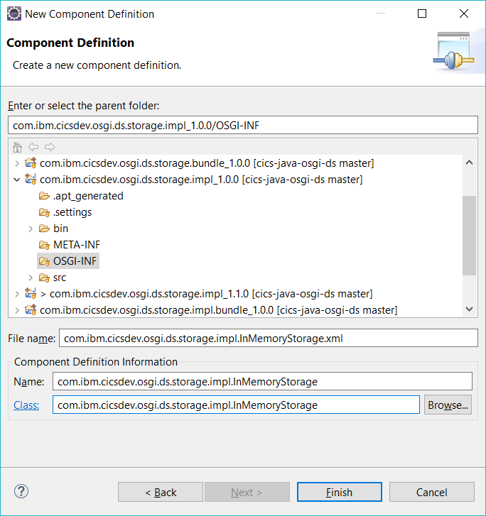
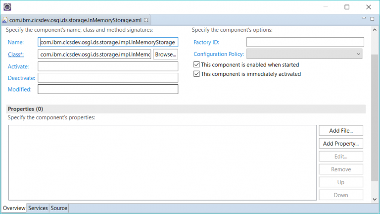

OSGi demystified: Declarative services
======================================
Authors: Alexander Brown, Ivan Hargreaves

*In this part of the OSGi Demystified series, Ivan and Alex explore declarative services in detail. They
demonstrate how to manage dependencies between different components of
an application, and how the services approach can provide dynamically
upgradable applications with zero downtime. The second half of this article uses sample code to build applications that handle updates to services without
outage*

### OSGi Services

At its core, OSGi is a framework for managing components and their
dependencies. In the OSGi articles, we've looked at how the OSGi framework
manages dependencies; mainly from the bundle-wiring perspective. We've
discovered that creating well defined dependencies between components
can provide a robust and predictable environment and vastly reduce
run-time failures.

But as the dependencies between your components grow more complex,
updates to any one component have a progressively larger impact. This
complexity is most noticeable when you attempt to dynamically update
parts of your application, it becomes extremely complex to declare your
bundle-wiring such that updates are realized. The OSGi framework will
\'wire\' one OSGi bundle to another at resolution time, and for the
lifetime of that component it is averse to re-wiring (re-wiring can lead
to breakage if the system has changed).

For this reason, OSGi services, not bundle-wiring, are the preferred
mechanism for providing dynamic update capability. As a general rule you
should \'wire\' to the stable API while using OSGi services to bind
dynamically to implementations of the API.

### Service Component Runtime (SCR)

The Service Component Runtime is an implementation of the OSGi
declarative services specification offering a service-oriented component
model to simplify OSGi-based development. Using this approach OSGi
bundles can be declared to provide service components, and those service
components are instantiated by the runtime based on a piece of
declarative XML (the component XML). The component XML also declares
dependencies on other service components along with policy to control
aspects of their behaviour.

Putting it more simplistically, it is a way to declaratively create
components and services from your OSGi bundles and have dependencies on
other services dynamically managed for you. It is this capability that
you were most likely searching for when you updated the *version* and
*version range* of your Import and Export Package statements in the
MANIFEST. If you found it more and more tedious managing all the
knock-on updates required to pick up newer versions of bundles - read
on.

Of course declarative services isn't complete magic - you have to
describe your components/dependencies and add some code hooks to get
driven. But compared to rolling your own services, you won't look back.

#### Component Life-cycle

Let's dive straight in. To create a component you need to reference
some component XML from your OSGi bundle. You can do that with the
following bundle directive in your MANIFEST.MF:

```xml
Service-Component: path/to/component.xml
```

Each OSGi bundle can contain one or more of these components, and each
component is described by some XML, similar to that shown below. At this
point we are just declaring a basic component with no services, we'll
add a service shortly.

```xml
<scr:component xmlns:scr="http://www.osgi.org/xmlns/scr/v1.1.0"
   name="example.ds.impl.MyComponent"
   activate="activate"
   deactivate="deactivate"
   modified="modified">

   <implementation class="com.ibm.cics.java.example.ds.impl.MyComponent"/>
</scr:component>
```

When your OSGi bundle is installed into the OSGi framework, the
MANIFEST.MF is read, the Service-Component directive is parsed, and the
component.xml is processed. That processing results in the SCR
instantiating an instance of your component class.

Each component has three life-cycle related callback methods. You can
optionally add these into your implementing Java class to be notified of
the life-cycle events. The events are *activate*, *modified* and
*deactivate*. *Activate* is called after all services are bound.
*Modified* is called when the component configuration is changed.
*Deactivate* is called before your component is deactivated.

The actual method names can be specified in the component XML file (as
seen above), but if omitted, will default to: `activate`, `modified`,
and `deactivate`. These methods can have zero or more arguments, each
argument must be either the ComponentContext, BundleContext, or a Map of
component properties. So let\'s see what that looks like if you choose
to implement them in your code:

```java

package com.ibm.cics.java.example.ds.impl;

import org.osgi.service.component.ComponentContext;

public class MyComponent
{
    protected void activate(BundleContext context)
    {
        // Use bundle context
    }

    protected void deactivate(ComponentContext context)
    {
        // Use component context
    }

    protected void modified(Map<String, Object> props)
    {
        // Use properties
    }
}
```

No rocket-science there! If you want those methods to be driven, add
them to the class specified as the implementation of your component.

And now that we've created a simple component from our OSGi bundle,
let\s provide a service.

### OSGi Services

OSGi services are simply services provided by OSGi bundles. An OSGi
bundle registers one or more services with the OSGi framework, which
operates as an OSGi service repository. OSGi bundles can be providers of
a service, or consumers, or both, or indeed neither.

In a basic implementation that doesn't use declarative services, the
activator of the OSGi bundle will call into the OSGi framework and
register the services provided by that bundle or look-up/bind to any
services it requires.

One of the key concepts to appreciate with OSGi services, is that the
life-cycle is dynamic. If an OSGi bundle is stopped, or uninstalled, any
services it provides are also stopped. There is no caching of services,
and consumers of a service are expected to react to these conditions
dynamically. Yes, that means you must code it all yourself. Groan.

However, as the use of OSGi services evolved, patterns of registering,
de-registering, binding and unbinding to services become apparent. Old
services can go, and new services appear. Frameworks provided classes
such as the ServiceTracker to reduce the amount of boiler-plate code
needed to react to these events. Eventually we arrived at the
declarative ways to configure services. These declarative approaches
take care of all the service tracking, unbinding and rebinding
automatically. Known as \'Declarative Services\' and implemented by the
SCR (Service Component Runtime) we have a very powerful mechanism at our
disposal.

### Implementing an OSGi Service

OSGi services are defined in two parts: the *service interface* and
*implementations* of this interface. Take note that Java interfaces and
OSGi service interfaces are **not** the same. OSGi service interfaces
can be defined as either Java classes or Java interfaces.

An implementation of an OSGi service is a Java class which extends the
service class or implements the service interface. A Java class may
provide implementations of many service interfaces. An OSGi service may
have multiple implementations.

So let's first look at how a service would be registered
programmatically. The OSGi APIs provide a method to register services
through the `BundleContext` object:

```java
public void registerService(BundleContext context)
{
    MyServiceImpl implementation = new MyServiceImpl();
    Dictionary<String, ?> properties = new Hashtable<>();

    ServiceRegistration<MyService> registration =
        context.registerService(MyService.class, implementation, properties);
}
```

A `ServiceRegistration` reference is returned by the framework when the
service implementation is registered. The OSGi bundle can use that same
reference to later de-register (unregister) the service.

### Declarative Services

Since OSGi version 4, a service can also be registered declaratively in
an XML file known as the *component.xml*. Taking this approach reduces
the amount of boilerplate code required within the application, and
allows developers to focus on business logic. Here\'s an example using
declarative services to register a service:

```java
<?xml version="1.0" encoding="UTF-8"?>
<scr:component xmlns:scr="http://www.osgi.org/xmlns/scr/v1.1.0"
   name="example.ds.impl.MyServiceImpl">

   <implementation class="com.ibm.cics.java.example.ds.impl.MyServiceImpl"/>
   <service>
      <provide interface="com.ibm.cics.java.example.ds.MyService"/>
   </service>
</scr:component>
```

In the *component.xml*, services implemented by this bundle are declared
with *provide* elements and placed within the *service* element. The
implementation class is indicated by the *implementation* element.

**Note:** When using OSGi declarative services, it's good practice to
use the lazy bundle activation policy (`Bundle-ActivationPolicy: lazy`).
Instantiation of declarative services is done lazily, i.e. just before
the service is called.

Alone, this declarative approach to defining services doesn't add much
value beyond removing the registration code. But service registration is
only one aspect of declarative services. Key to declarative services is
the ability to reference other services, to react to the loss of
services, and to rebind to new implementations of services. Declarative
services handles all that flux automatically and seamlessly.

Now lets look at how service references can be defined in the component
XML and called using Java APIs.

### Service References

We've previously seen how a bundle can register itself as an
implementation of a service. So let\'s take a look at how a bundle can
consume other services.

```xml
<scr:component xmlns:scr="http://www.osgi.org/xmlns/scr/v1.1.0"
   name="example.ds.impl.MyServiceImpl">

   <implementation class="com.ibm.cics.java.example.ds.impl.MyServiceImpl"/>
   <service>
      <provide interface="com.ibm.cics.java.example.ds.MyService"/>
      <reference cardinality="0..1"
         interface="com.ibm.cics.example.java.ds.MyReferenceServiceService"
         name="ReferenceService"
         policy="dynamic"
         bind="setReferenceService"
         unbind="unsetReferenceService"/>
   </service>
</scr:component>
```

The component XML is used to express dependencies on other services. A
`reference` element is used for each service we wish to consume. The
reference element can further be refined with attributes such as the
cardinality of the service. Will our component bind to one, or many
implementations of that service? Is the referenced service optional or
compulsory? Can we bind dynamically to the service? Will we actively
bind to newer versions if they become available? We'll look at all
these options in more detail shortly, but first let's see what these
references actually translate to in the code of your class:

```java
package com.ibm.cics.java.example.ds.impl;

import com.ibm.cics.java.example.ds.MyService;
import com.ibm.cics.java.example.ds.MyReferenceService;

public class MyServiceImpl implements MyService
{
    private MyReferenceService referenceService;

    public void setReferenceService(MyReferenceService referenceService)
    {
        this.referenceService = referenceService;
    }

    public void unsetReferenceService(MyReferenceService referenceService)
    {
        if(this.referenceService == referenceService)
        {
            this.referenceService = null;
        }
    }
}
```

The Service Component Runtime (SCR) performs the mapping from your
component.xml to your Java class. It will act upon the declarations, it
will look-up services, generate instances and drive the set and unset
methods to inject appropriate service instances into your class. The SCR
guarantees that service changes will be seamless. If a service you were
relying upon is taken down, as long as there remains an implementation
to bind to, there are no transient failures nor loss of service. This is
a very powerful and extremely useful benefit of declarative services.

### Reference attributes

As promised let's look at how the `reference` element attributes
determine the behaviour of your component. Here's a recap of the
attributes we used:

`cardinality="0..1" interface="com.ibm.cics.example.java.ds.MyReferenceServiceService" name="ReferenceService" policy="dynamic" bind="setReferenceService" unbind="unsetReferenceService"`

The `cardinality` attribute is probably the most important of these
attributes, it determines whether you bind to one or more services and
whether it is optional or mandatory to bind to that service. If the
cardinality is optional and the service exists - you will bind to it, if
the service does not exist - you won't bind. In either event your
component will still activate.

The value we used *0..1* means the service reference is optional and
bound to a maximum of 1 service. If the referenced service was not
active when our component is installed we'll activate anyway and if at
a later time a matching service became active, we will be bound to it at
that time. If an implementation of the referenced service is already
bound and another one is activated, by default nothing happens (see
policy attributes later to change that). That's because your component
already has its single reference. If the referenced service is
deactivated, then the reference will be unbound and another service
seamlessly bound in its place.

If we had chosen a cardinality of *1..1* and there was no referenced
service available, our component would remain inactive until such time
as a referenced service became available.

The following table should help you understand these options in more
detail:

  |Cardinality |  Required|   Number of services|   Started|
  |------------|-----------|--------------------|---------------|
  |0..1      |    No   |      Zero or one|          Can be started without any services bound|
  |1..1     |     Yes   |     Exactly one   |       A service must be bound for the declared service to start|
  |0..\*    |     No     |    Zero or more   |      Can be started without any services bound|
  |1..\*      |   Yes     |   At least one   |      At least one service must be bound for the declared service to start|

 The `interface` and `name` attributes are self-explanatory, while the
`bind` and `unbind` attributes correspond directly to the names of the
methods in your Java class that the SCR will call to set/unset service
references. If not specified these will default to the pattern set*Name*
and unset*Name*.

### Dynamically Binding Services

The `policy` attribute is another key attribute, it controls how your
component reacts when it rebinds to a service. Policy can be set to
*static* or *dynamic*, and defaults to *static*. A static policy means
that the service is restarted when a reference is bound or unbound from
an active service. With the dynamic policy, binds and unbinds can occur
on an active component. By default both static and dynamic policy are
RELUCTANT, that is to say, once bound to a service they prefer not to
bind to another. This behaviour can be controlled by setting the
`policyOption` attribute to *GREEDY*. When set to GREEDY, if a newer
version of the referenced service is activated, your component will bind
to that newer version and the existing service is unbound (in that order
to prevent any outage).

#### Summary

So hopefully our whistle-stop tour of declarative services has given you
an appetite and an understanding of how to achieve dynamic updates in
OSGi. We've only covered the basics here to give you a taster, and
we've only covered the declarative aspect through component.xml. One of
the latest updates to declarative services is to provide a completely
annotation driven equivalent of the component XML. If you are more
comfortable with annotations and don't mind the declarations
effectively becoming part of the source code rather than separate
\'build\' entities such as the component XML, then everything we have
described here can be done with DS annotations. We're leaving that as
an exercise for the reader! But trust us, the concepts are the same -
arguably it's even easier to add \@Component and \@activate, and \@bind
or \@unbind annotations to your source to achieve those same results!

Now let's go on to implementation ...  

## Tutorial: dynamically updating applications without outage using OSGi's Declarative Services

This section looks at
how we can use OSGi's declarative
services to build applications that handle updates to services without
outage. We'll use the [simple
project](https://github.com/CICSDev/cics-java-osgi-ds) that's readily
available on the CICSDev GitHub.

In this sample, we have a hypothetical requirement to create a local
storage service. The storage service operates by providing some string
data and getting an ID number in response. The ID number can be used to
look up the data from the service at a later time. The sample is fairly
simple and contrived, but serves our purpose to showcase declarative
services.

To import the projects, simply clone or download the git repository onto
your local filesystem. Then, in Eclipse,
`File → Import... → Existing Projects into Workspace`. The
`root directory` is the directory where the git repository has been
downloaded to. Ensure all projects are selected then click `Finish`. You
may also need to set your target platform to
`CICS TS 5.4 with Java EE and Liberty` (replacing 5.4 with the relevant
version of CICS) to compile the projects.

#### Interface Definition

As well behaved programmers we're going to make use of interfaces, so
our first task is to determine the OSGi interfaces needed to define our
services. A well designed interface will need less change and be easily
extensible. Typically, we consider it a minor change to add to an
interface, and a major change to remove from or modify existing methods
of an interface. The latter almost certainly requires dependent code to
be modified and could result in more disruption.

Good practice dictates we should define the API and implementation in
separate bundles. If we didn't, and modified an implementation stored
with an API, the API dependencies alone would likely cause a cascade of
bundle refreshes. By separating API and implementation(s) we can add and
remove implementations without affecting the API. We'll also package
each OSGi bundle in its own CICS bundle for similar reasons.

In the API bundle `com.ibm.cicsdev.osgi.ds.storage`, we define the
`StorageService` interface and export it using the `Export-Package`
header in the OSGi manifest. That gives us a contract to work to. At
this point we're free to write either the application that will use this
code, or the implementation. Both could even be done at the same time by
different teams -- neither team needing to know what the other will do,
as long as they keep to the interface.

#### The first implementation

We'll write a very simple implementation first, something that can be
used to verify the behaviour without doing anything complex. On a larger
scale project, the team writing the application might even want to
create a mock or stub service to verify the application without needing
a real implementation.

In a new implementation bundle `com.ibm.cicsdev.osgi.ds.storage.impl`
version 1.0.0, we create the Java class `InMemoryStorage`, implementing
the `StorageService` interface. In this service, we just *add* and
*read* a Java list. We then register our implementation using the
declarative services component definition XML. In the component
definition XML, we define that the `InMemoryStorage` class is an
implementation of the `StorageService`. This allows the OSGi framework
to handle the process of registering it as an OSGi service.

In Eclipse, these component definition XML files can be created and
easily edited. Create a `New → Other... → Component Definition`. The
`parent folder`, by convention, is the OSGI-INF directory under the root
of the project. Choose a `file name`, a `name` for the service, and the
`class` the service uses.



This will create the component XML file, and open a visual editor, which
allows the above detail to be defined easily:



This OSGi bundle is also packaged into its own CICS bundle. For a lot of
projects it makes sense to keep them individual allowing them to be
swapped in and out easily.

#### Writing the CICS application

The next task is to write the CICS application that will use the
service. In our system, the application is a CICS program that's invoked
via a CICS transaction. But it could just as easily be linked to from
another CICS program or invoked through a web service of some form.

We create the OSGi bundle `com.ibm.cicsdev.osgi.ds.cicsapp` to package
the application code, and the class `CICSApp` processes parameters from
the terminal and invokes the service. In this class you'll notice
there's methods for binding and unbinding the storage service too.

Using declarative services, we create a component XML descriptor, which
specifies that the `CICSApp` class is an OSGi service which references
the storage service, with a cardinality of 1..1 (so exactly one service
must be bound at a time). As we haven't specified otherwise, services
will be bound reluctantly -- so even if a service with a higher ranking
is available the current service will remain bound. The resulting XML
looks like this:

```xml
<?xml version="1.0" encoding="UTF-8"?>
<scr:component xmlns:scr="http://www.osgi.org/xmlns/scr/v1.1.0"
               activate="activate"
               deactivate="deactivate"
               modified="modified"
               name="com.ibm.cicsdev.osgi.ds.app.CICSApp">
   <implementation class="com.ibm.cicsdev.osgi.ds.cicsapp.CICSApp"/>
   <reference name="StorageService"
              interface="com.ibm.cicsdev.osgi.ds.storage.StorageService"
              bind="bindStorageService"
              unbind="unbindStorageService"
              cardinality="1..1"
              policy="dynamic" />
</scr:component>
```

We also provide a `CICS-MainClass` header in the OSGi manifest to ensure
CICS can resolve this class for program link.

As well as packaging this application in its own CICS bundle, we provide
the accompanying PROGRAM and TRANSACTION resource definitions in the
CICS bundle. Although not strictly necessary, keeping the application's
dependencies together within the same package, is very convenient. Now
we're ready to deploy the first version of this application.

#### Deploy version 1.0.0 of the application

Having deployed the CICS bundles to USS and defined CICS resources,
here's an overview of the naming scheme we've employed:

  |CICS Bundle Name|   OSGi Bundle            |                  Version |  Description|
  |----------------|--------------------------|--------------------------|-------------|
  |DS          |       `com.ibm.cicsdev.osgi.ds.storage` |       1.0.0  |   The OSGi interface bundle|
  |DS-APP        |     `com.ibm.cicsdev.osgi.ds.cicsapp`    |    1.0.0   |  The CICS application OSGi bundle|
  |DS-IMP10        |   `com.ibm.cicsdev.osgi.ds.storage.impl` |  1.0.0   |  The in-memory implementation of the storage service|

Install all three CICS bundles, then run the transaction `DSTS`. To put
data into the storage service, use the syntax `DSTS PUT data`, this will
return the string: "Created entry *item*", where *item* is the item ID
of the stored data.

To retrieve data, use the syntax `DSTS GET item`, where *item* is the
integer item ID to retrieve. Note that for both of these, we start our
indexes at 1, not 0.

This should verify that the code is all working with this first simple
implementation of our storage service.

#### CICS TSQ storage service

We think we can do better and provide a more capable version of our
storage service. So let's look at using a CICS TSQ to store data
instead. TSQs don't need to be defined before use, which keeps the
set-up minimal for our sample. However, in a real world example, we'd
probably use something that's more persistent like VSAM, Db2 or the
coupling facility.

We'll show later how we can lean on DS and the OSGi framework to upgrade
the services with no downtime for the application, but first let's
create another OSGi bundle, `com.ibm.cicsdev.osgi.ds.storage.impl` with
version 1.1.0. In this implementation the class `TSQStorage` contains
the logic for reading and writing to a CICS TSQ. As with the in-memory
servce, we define the DS component XML descriptor and mark this as an
implementation of the storage service. Package up the new implementation
in a CICS bundle and export it to zFS. To recap, here's a list of the
OSGi and CICS bundles you should have:

  |CICS Bundle Name |  OSGi Bundle  |                        Version |  Description|
  |-----------------|---------------|--------------------------------|-------------|
|  DS         |        `com.ibm.cicsdev.osgi.ds.storage`   |     1.0.0   |  The OSGi interface bundle|
|  DS-APP    |         `com.ibm.cicsdev.osgi.ds.cicsapp`   |     1.0.0   |  The CICS application OSGi bundle|
|  DS-IMP10    |       `com.ibm.cicsdev.osgi.ds.storage.impl` |  1.0.0    | The in-memory implementation of the storage service|
|  DS-IMP11      |     `com.ibm.cicsdev.osgi.ds.storage.impl` |  1.1.0   |  The TSQ implementation of the storage service|

#### Upgrading with zero downtime

Although the TSQ implementation of our storage service is installed and
available, the application will continue to use the in-memory service
until that service is disabled. That's because we bound the storage
service reluctantly, the default.

Even though the TSQ service is not bound to our application, it may be
bound to other services if they used a *1..n* cardinality, or had the
greedy policy option. In our service we could use this to migrate data
from the old service to the new service to avoid data loss during the
upgrade. For simplicity we won't cover this in our sample.

If we disable the `DS-IMP10` bundle, you should notice some interesting
events. Before the in-memory service is disabled, all services which
reference it must be processed. The CICSApp service references this
service, so CICSApp must either bind to another storage service, or it
will be disabled. Fortunately we have the TSQ service available, so
CICSApp is rebound to that service. Once all the references to our
in-memory service have been processed, the in-memory service itself can
then be unbound and finally it can be disabled. A keen observer will
note that there's never a time at which the CICSApp is without a storage
service -- in fact there's a moment where it has two. The net result is
that during the swap over of service implementations, there is zero
downtime. All by virtue of using OSGi declarative services.

It is easy to see the benefit of these types of seamless updates being
made in a large running system with chains of referenced services. Being
able to upgrade individual services without affecting the larger system
is incredibly powerful.

#### Final Thoughts

In this article we have seen an example of how to build applications
that use OSGi declarative services. We've seen how to design services so
they can be upgraded with zero downtime, and we've touched on some
important architectural designs like separating API from implementation
and separating business logic from user-interface. We hope it has
enthused you and opened up a world of possibilities for your
applications and your business.

### Further Reading

-   [OSGi Bundles: Declarative Services](http://alexander.holbreich.org/osgi_ds/)
-   [Getting Started with OSGi: Declarative Services and Dependencies](https://www.eclipsezone.com//eclipse/forums/t97690.rhtml)
-   [Getting Started with OSGi: Introducing Declarative Services](https://www.eclipsezone.com//eclipse/forums/t96740.html)
-   [OSGi Services --Tutorial](http://www.vogella.com/tutorials/OSGiServices/article.html)
